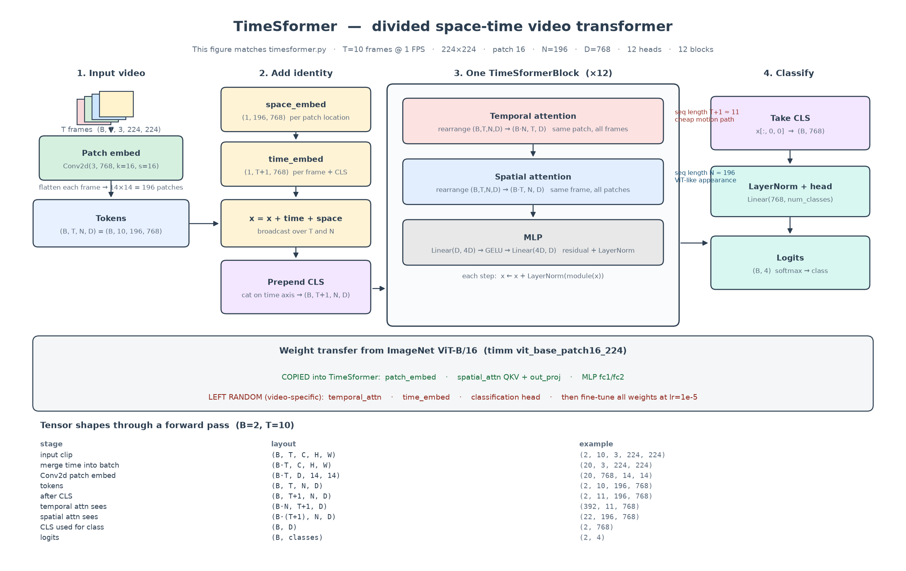
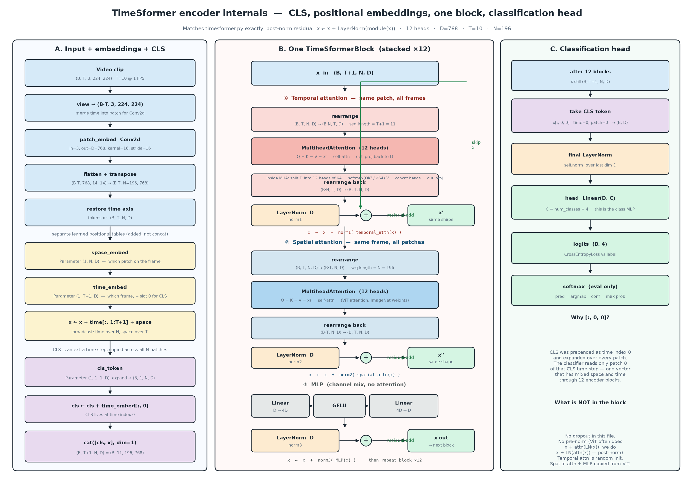

# TimeSformer tutorial

This folder trains a **TimeSformer**: a Vision Transformer extended from one image to a short video. Read this alongside [`timesformer.py`](timesformer.py). If you already understand [`../vision_transformer/vit.py`](../vision_transformer/vit.py), most of this is the same idea with an extra time axis.

## What you should already know (ViT)

In the MNIST ViT:

1. Split an image into patches.
2. Embed each patch.
3. Add a CLS token and position embeddings.
4. Run self-attention over patches.
5. Classify from the CLS token.

A video is **several frames**. TimeSformer still patches each frame, then lets tokens talk across **time** (same patch, different frames) and across **space** (same frame, different patches). That split is called **divided space-time attention**.

## Architecture

This is the exact pipeline in `timesformer.py` (T=10 frames at 1 FPS, ViT-B/16 sizes):



Zoomed encoder: CLS, time/space embeddings, one block (temporal attn → LN → residual, spatial attn → LN → residual, MLP → LN → residual), then the class head.



`T` = frames (10 at 1 FPS), `N` = patches per frame `(224/16)² = 196`, `D` = embedding size (768). Regenerate with `python draw_arch.py` and `python draw_encoder.py`.

## How to run it

```bash
cd video_timesformer
source .venv/bin/activate
python timesformer.py --data-dir data/frames
```

After training you get:

- `timesformer.pt` — weights
- `predictions.csv` — every clip, true vs predicted class
- `predictions.png` — a few frames per class (green = correct, red = wrong)

Re-run the report without training:

```bash
python timesformer.py --data-dir data/frames --eval-only --checkpoint timesformer.pt
```

`download_kinetics.py` is **not** the model. It only fetched ~10 Kinetics clips per class and extracted JPEG frames.

---

## Step 1 — Dataset: folders of frames, not `.mp4`

`VideoFrameDataset` expects:

```text
data/frames/
  faceplanting/
    1i5P7hhwUmI/   frame_0001.jpg ...
  punching_person_boxing/
    ...
  skydiving/
  slapping/
```

Each **class folder** is a label. Each **clip folder** is one sample.

`__init__` walks those folders, builds `class_to_idx`, and stores `(video_path, label)` in `self.samples`.

`__getitem__` does three important things:

1. Lists image files in the clip folder.
2. If the clip is shorter than 8 frames, it **repeats** the list until it is long enough.
3. Picks 8 frames evenly with `torch.linspace` (first, last, and points in between).

Each frame is resized to 224×224 and stacked:

```text
video shape = (T, C, H, W) = (8, 3, 224, 224)
```

The DataLoader then adds a batch dimension: `(B, T, C, H, W)`. Default `B=2`.

This is the video analogue of `transforms.ToTensor()` on MNIST. The model never sees an `.mp4`; ffmpeg already turned videos into JPEGs.

---

## Step 2 — Patch embedding (same trick as ViT)

In `TimeSformer.forward`, the batch of clips arrives as `(B, T, C, H, W)`. Convolution does not want a time axis, so frames are flattened into the batch:

```text
(B, T, C, H, W) → view → (B*T, C, H, W)
```

Then:

```python
self.patch_embed = nn.Conv2d(3, 768, kernel_size=16, stride=16)
```

A 16×16 kernel with stride 16 is “cut the image into non-overlapping patches and linearly embed each one.” For 224×224 that yields a 14×14 grid = **196 patches**.

After `flatten` + `transpose` and restoring the time axis:

```text
(B*T, 196, 768) → (B, T, 196, 768)
```

That 4D tensor is the rest of the model: batch, time, patch, channel.

Compare to MNIST ViT: 28×28, patch 7, 1 channel, `embed_dim=64`. Same `Conv2d` idea, different sizes.

---

## Step 3 — Where am I in space and time?

A Transformer has no built-in notion of “this patch is top-left” or “this is frame 3.” Two learned tables supply that:

- `space_embed`: shape `(1, 196, 768)` — one vector per patch location, **shared across frames**
- `time_embed`: shape `(1, T+1, 768)` — one vector per time index, including a slot for CLS

They are **added**, not concatenated:

```text
x = x + time_embed[1:T+1] + space_embed
```

Broadcasting: time_embed is repeated over patches, space_embed is repeated over frames. Token `(t, n)` gets “frame t” + “patch n.”

---

## Step 4 — CLS token

ViT prepends one CLS token on the patch axis. This TimeSformer prepends a **whole extra time step** of CLS tokens:

```text
cls: (B, 1, 196, 768)
x:   (B, T, 196, 768)
cat on dim=1 → (B, T+1, 196, 768)
```

After the blocks, the classifier reads **only** `x[:, 0, 0]` — time 0, patch 0. The other CLS patch slots exist so temporal attention has a matching patch count; they are not used as the class vector.

This is a simplified teaching version. The paper’s CLS handling is a bit different. The idea is the same: a summary token that can attend over the clip, then a linear head.

---

## Step 5 — One block: time, then space, then MLP

`TimeSformerBlock` is the core. Input `x` is `(B, T, N, D)`.

### 5a. Temporal attention

Question: for a **fixed patch location**, how does that spot change across frames?

`einops.rearrange` folds batch and patch together so attention sees a sequence of length `T`:

```text
(B, T, N, D) → (B*N, T, D)
```

`nn.MultiheadAttention` then does Q=K=V on that length-`T` sequence. Patch 37 in frame 0 can attend to patch 37 in frames 1…7, but **not** to a different patch. That is cheap: sequence length is 8, not 8×196.

Then reshape back to `(B, T, N, D)` and residual-add.

### 5b. Spatial attention

Question: **inside one frame**, which patches matter?

```text
(B, T, N, D) → (B*T, N, D)
```

Now the sequence length is 196, same as ViT on one image. Frame 3’s patches attend to each other; they do not look at other frames in this step.

### 5c. MLP

Same as ViT: `Linear(D, 4D) → GELU → Linear(4D, D)`, plus residual.

### Why split attention?

Joint space-time attention would use sequence length `T×N` (8×196 = 1568). Divided attention does 8, then 196. That is the main TimeSformer efficiency trick ([paper](https://arxiv.org/pdf/2102.05095.pdf)).

**Norm note:** this notebook uses `x = x + LayerNorm(attn(x))`. Many Transformers use pre-norm `x = x + attn(LayerNorm(x))`. Keep that in mind if you compare to Hugging Face TimeSformer.

---

## Step 6 — Stack 12 blocks, then classify

`depth=12`, `heads=12`, `embed_dim=768` matches **ViT-B/16**, so ImageNet weights can be copied into the spatial parts.

```text
x[:, 0, 0] → LayerNorm → Linear(768, num_classes)
```

`num_classes` is `len(dataset.classes)` (4 here). Output logits shape `(B, 4)`.

---

## Step 7 — Steal ImageNet ViT weights

Training a 12-layer 768-d transformer from scratch on ~50 clips will not work. `timm.create_model("vit_base_patch16_224", pretrained=True)` loads a ViT trained on images.

`load_vit_weights_into_timesformer` copies:

| TimeSformer | ViT |
|---|---|
| `patch_embed` | `patch_embed.proj` |
| `spatial_attn` QKV / out | `attn.qkv` / `attn.proj` |
| MLP `fc1`, `fc2` | `mlp.fc1`, `mlp.fc2` |

**Not copied:** temporal attention, time embeddings, classification head. Those start random. Fine-tune everything with AdamW at `lr=1e-5` (small, because most weights already know “what an image looks like”).

`nn.MultiheadAttention` stores Q, K, V packed in `in_proj_weight`. ViT’s `attn.qkv.weight` is the same packing, so a straight `copy_` works.

---

## Step 8 — Train loop

`train_one_epoch` is the usual PyTorch pattern, identical in spirit to `vit.py`:

```text
logits = model(videos)
loss = CrossEntropy(logits, labels)
zero_grad → backward → optimizer.step
```

Accuracy is `argmax(logits) == label` over the epoch.

There is **no validation split**. The number printed each epoch is train accuracy. With 56 clips the model can memorize; that is why boxing can hit 100% while other classes stay at 0% — it may collapse onto the class with the most (or easiest) examples.

`main()` then `torch.save`s `timesformer.pt`.

---

## Step 9 — See results per video

`report_predictions` puts the model in `eval()`, runs **every clip** with batch size 1, and for each:

1. Softmax → predicted class and confidence.
2. Prints clip id, true label, pred label, Y/N, confidence.
3. Writes `predictions.csv`.
4. Takes 3 clips per class, shows the **middle frame**, titles it true vs pred (green/red), saves `predictions.png`.

`--eval-only` skips training and loads `timesformer.pt` instead.

---

## Shapes cheat sheet

Assume `B=2`, `T=8`, `H=W=224`, `P=16`, `D=768`, `N=196`.

| stage | shape |
|---|---|
| dataset item | `(8, 3, 224, 224)` |
| loader batch | `(2, 8, 3, 224, 224)` |
| after merge frames into batch | `(16, 3, 224, 224)` |
| after patch Conv2d | `(16, 768, 14, 14)` |
| tokens | `(2, 8, 196, 768)` |
| after CLS | `(2, 9, 196, 768)` |
| temporal attn sees | `(2*196, 9, 768)` |
| spatial attn sees | `(2*9, 196, 768)` |
| CLS used for class | `(2, 768)` |
| logits | `(2, 4)` |

---

## Map onto `timesformer.py`

| lines (approx) | what |
|---|---|
| 20–87 | `VideoFrameDataset` |
| 90–125 | `TimeSformerBlock` (time then space then MLP) |
| 128–181 | `TimeSformer` (embed, CLS, 12 blocks, head) |
| 184–199 | copy ViT spatial weights |
| 202–228 | one training epoch |
| 231–326 | print / CSV / PNG predictions |
| 353–405 | `main`: data → model → train or load → report |

Read the file top to bottom in that order. The only conceptually new piece versus ViT is **Step 5a**: rearrange so attention runs along time for each patch, then along space for each frame.
