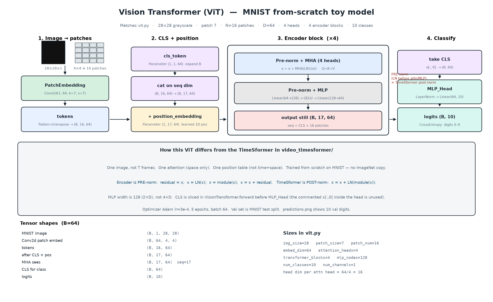
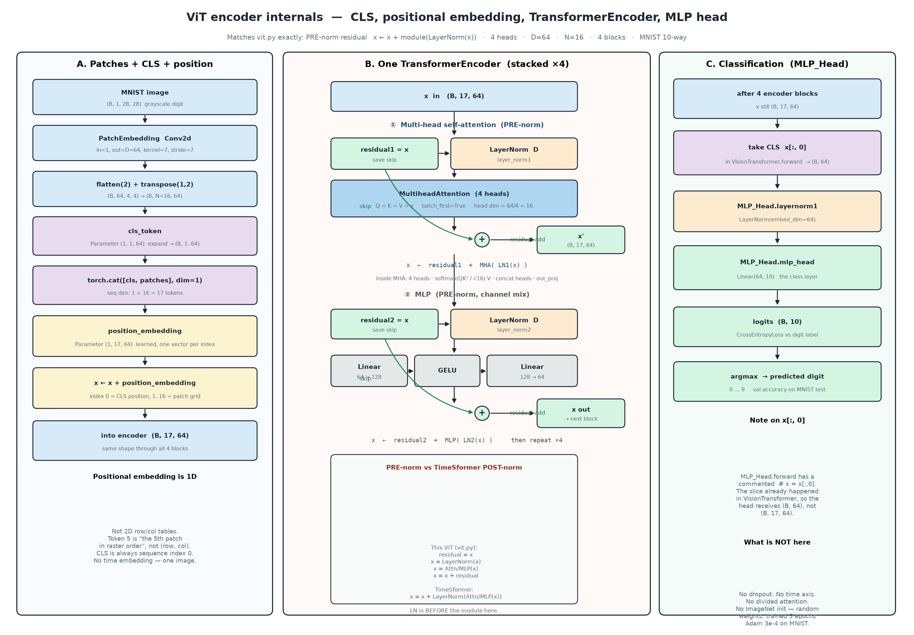

# Vision Transformer (MNIST)

Toy ViT in [`vit.py`](vit.py): 28×28 grayscale digits, patch size 7, 4 encoder blocks, 10 classes. Trained from scratch (no ImageNet).

## Architecture

Overview of the full model:



Encoder internals — CLS token, positional embedding, one `TransformerEncoder` (pre-norm attention + MLP + residual-add), then `MLP_Head`:



Regenerate with:

```bash
.venv/bin/python draw_arch.py
.venv/bin/python draw_encoder.py
```

## How this differs from TimeSformer

| | this ViT | TimeSformer |
|---|---|---|
| Input | one image `(B, 1, 28, 28)` | video `(B, T, 3, 224, 224)` |
| Attention | spatial only | temporal then spatial |
| Position | one table length 17 | `time_embed` + `space_embed` |
| Encoder norm | **pre-norm** `x + module(LN(x))` | **post-norm** `x + LN(module(x))` |
| Weights | random, train on MNIST | copy ImageNet ViT spatial parts |

## Run

```bash
cd vision_transformer
source .venv/bin/activate
python vit.py
```

Writes `predictions.png` (10 val digits).
